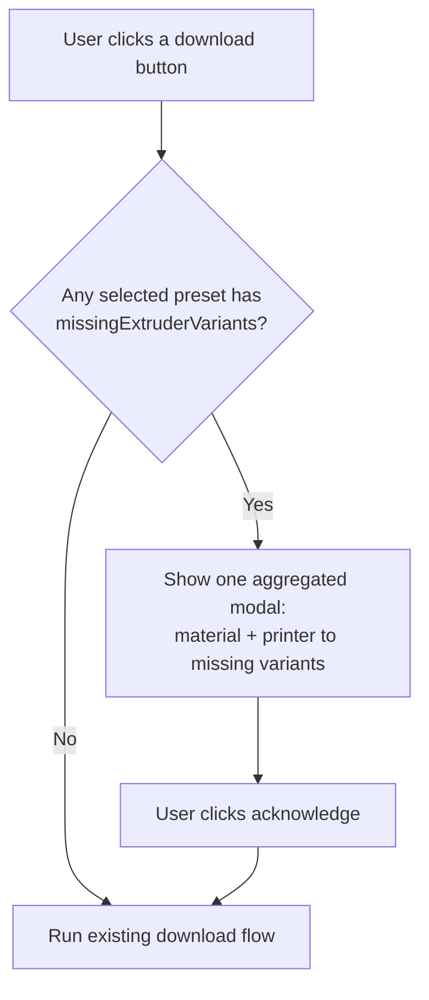

# Missing Extruder-Variant Download Warning

## Problem

Bambu Lab printers with more than one extruder/nozzle option (e.g. X2D, H2D, H2C, H2S, P2S, X1) store per-variant values inside each filament preset as arrays aligned to `filament_extruder_variant`. When a column is the string `"nil"`, that nozzle/extruder option has **no tuned values** — Polymaker did not author a preset for it (this includes the auxiliary "Bowden" nozzle on dual-nozzle machines).

A user who downloads such a preset and prints with one of those nozzle options gets no tuned values and no explanation. We need to make the gap visible.

In the current `preset/` data, 6 BBL models expose multi-variant presets, and 79 of 171 multi-variant presets have at least one `"nil"` column. Because the gap is common, the warning must be ambient and non-annoying rather than a constant interruption.

## Goal

1. Detect, per preset, exactly which extruder variants have no values.
2. Surface that ambiently with an inline badge on affected presets.
3. On download, show a single aggregated, acknowledge-only modal naming the missing variants so the user is never surprised.

Out of scope: changing any preset contents, authoring the missing presets, or altering slicer behavior.

## Detection rule (build-time)

Implemented in `scripts/generate-index-json.mjs`.

- A preset is **multi-variant** when its JSON has `filament_extruder_variant` as an array of length > 1.
- The authority field is `nozzle_temperature` (an array aligned index-for-index with `filament_extruder_variant`).
- For each index `i`, if `String(nozzle_temperature[i]) === "nil"`, the variant named `filament_extruder_variant[i]` is **missing**.
- The broad rule applies: **any** `nil` column counts as missing (no special-casing of High Flow vs Bowden).

Example: `filament_extruder_variant = ["Direct Drive Standard","Direct Drive High Flow","Bowden Standard","Bowden High Flow"]` with `nozzle_temperature = ["280","nil","nil","nil"]` yields missing `["Direct Drive High Flow","Bowden Standard","Bowden High Flow"]`.

Edge cases:
- `filament_extruder_variant` absent or length ≤ 1 → not multi-variant → no field emitted.
- `nozzle_temperature` missing, not an array, or a different length than `filament_extruder_variant` → skip detection for that preset and `console.warn` (consistent with existing parse-failure handling); emit no field.
- No `nil` columns → emit no field (so unaffected presets stay untouched).

## `index.json` schema change

Each affected preset object gains one field, omitted entirely when nothing is missing:

```json
"missingExtruderVariants": ["Direct Drive High Flow", "Bowden Standard", "Bowden High Flow"]
```

The app reads this list directly and never parses preset internals.

## App behavior

### Inline badge (ambient signal)

In `app.js`, `generatePresetRowHtml(p, options)` (around line 1554) renders each preset `<tr>`. When `p.missingExtruderVariants` is a non-empty array, render a small warning badge in the material cell next to the preset name.

- The badge is a static element with a `title` (tooltip) listing the missing variant names.
- Purely visual; it does not block or alter the row's download buttons.
- Folder (parent) rows show the badge when any child preset is affected.

### Download-time modal (explicit confirm)

The two download entry points both gain a guard at the top before they begin fetching/zipping:

- `downloadSelectedPresets()` (around line 921)
- `downloadSelectedBundle()` (around line 1043)

Guard logic:

1. From the selected presets, collect those with a non-empty `missingExtruderVariants`.
2. If none, proceed unchanged.
3. If any, show one aggregated modal. The download proceeds only after the user clicks the single acknowledge button; the modal is informational, so there is no Cancel — acknowledging continues the existing download flow.

The modal aggregates by material + printer model, listing the exact missing variant names per entry. One modal per download action — never one per preset.



### Modal content

All strings route through `i18n.js` (`t(...)`), matching existing usage. The body names exact variants, for example:

> Some selected presets don't include every nozzle option for this printer. We didn't make presets for these extruder/nozzle variants:
> - PolyLite PLA — Bambu Lab X2D: Direct Drive High Flow, Bowden Standard, Bowden High Flow
>
> You can still download — those nozzle options just won't have tuned values.

Button: a single acknowledge action labeled to make clear the download continues (e.g. "Download anyway").

## Testing

- `scripts/generate-index-json.test.mjs`:
  - Fixture preset with `nozzle_temperature: ["280","nil"]` and matching 2-entry `filament_extruder_variant` → asserts `missingExtruderVariants: ["Direct Drive High Flow"]`.
  - Fully-populated multi-variant preset → field absent.
  - Single-variant / missing `filament_extruder_variant` → field absent.
  - Length-mismatch between the two arrays → field absent (and warned), not a crash.
- App-level test (in the style of `scripts/app-filter.test.mjs`):
  - Given a selection containing presets with `missingExtruderVariants`, the guard returns the correct aggregated material→variant mapping and a "modal needed" flag.
  - Given a selection with none, the guard reports "no modal".

## Files touched

- `scripts/generate-index-json.mjs` — detection + new field.
- `scripts/generate-index-json.test.mjs` — detection tests.
- `index.json` — regenerated with the new field.
- `app.js` — badge rendering in `generatePresetRowHtml`; guard + modal in the two download paths.
- `i18n.js` — new message keys.
- `style.css` — badge and modal styles.
- A new app-level test for the guard.
